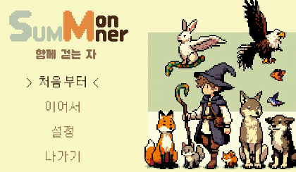
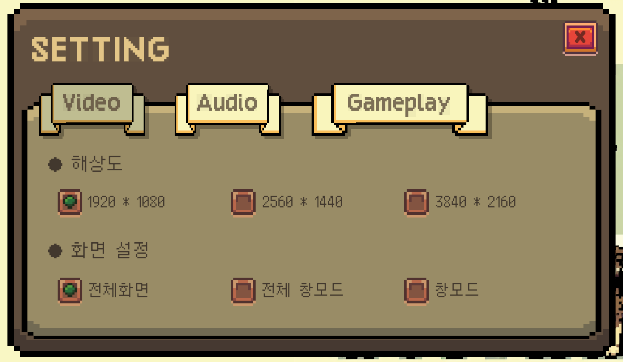
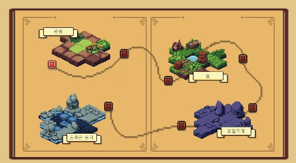
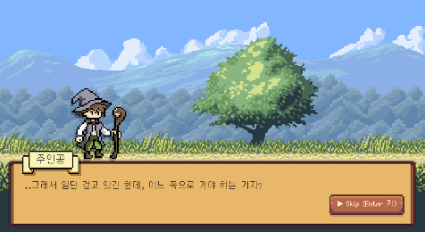
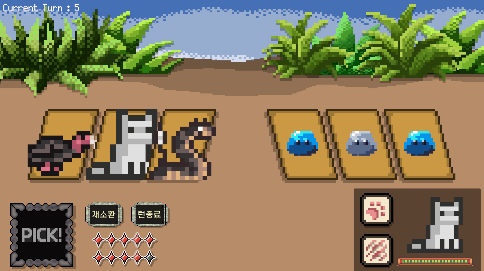
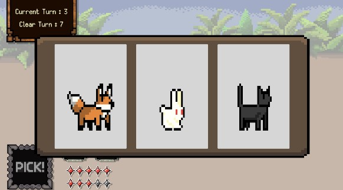
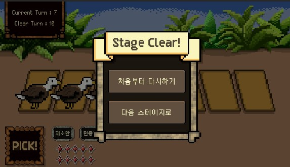

# SUMMONER_Repo
2D 턴제 전략 전투 게임 SUMMONER 개발 프로젝트
[📄 프로젝트 보고서 PDF](./ReadMe/서머너_로직.pdf)
### 프로젝트 설명
게임 프로젝트 'SUMMONER'는 플레이어의 전투 전략에 대응이 가능한 전투 AI를 설계하고, 이를 탑재한 게임을 설계 및 개발하는 프로젝트입니다. 
> **[사용 프로그램]** 
  > - Unity Engine
> - Visual Studio 2022

### 소속 인원
**📢 팀장** 
김민선 [LEI-2812]
 

**📇 팀원** 
김경훈 [rudIsland]
 
김태양 [E1phane]

### 일정 정리
일정은 notion 페이지를 이용해 전체 내용을 정리하고 세부 개발 일정은 깃허브의 이슈로 조정합니다. 
[📅 일정 페이지]

[LEI-2812]:https://github.com/LEI-2812
[rudIsland]:https://github.com/rudIsland
[E1phane]:https://github.com/E1phane

[📅 일정 페이지]:https://lei2812.notion.site/dbd8b6d357e040a8a4b263a3a2352243?v=a0360b83941b46b5a3f22c8a656c2d82&pvs=4
[📇 개발 과정 정리]:https://github.com/users/LEI-2812/projects/6

## 🕹️ 인게임 이미지

  

  

  

  

  

  

  

  

