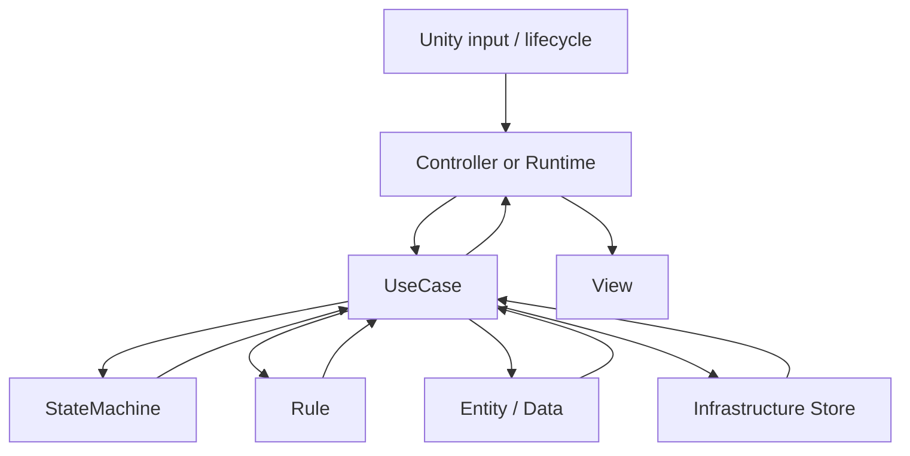

# Architecture Role Rule

## Purpose

Use one readable architecture vocabulary across the project. Unity remains component-based, folders are feature-based, and each feature is organized by responsibility only when that responsibility exists in the current code.

Target runtime flow:

```text
User Input
-> Controller
-> UseCase
-> Entity / Domain Rule
-> UseCase Result
-> Controller
-> View Update
```

## Source Structure Direction

Read source code by feature flow first, then by layer. A layer folder is a support
boundary inside one feature, not the first thing to search.

Recommended reading order:

```text
Feature flow
-> Controller / Runtime entry
-> UseCase
-> StateMachine / Rule
-> Entity / Data / Store
-> View update
```

Role split:

| Role | Owns | Must Not Own |
|---|---|---|
| `View` / `Controller` | Unity lifecycle, serialized references, input events, screen/sound/effect updates | save progress, scene-flow decisions, battle result decisions, domain calculation |
| `UseCase` | one user/game action flow, sequencing, result handling, calls to rules/states/stores | only forwarding one method call, pure decision logic |
| `StateMachine` | current state and legal transitions | creating or executing UseCases, UI reset, scene/prefab lookup |
| `Rule` | decision only | execution, logging-heavy orchestration, Unity object mutation |
| `Entity` / `State` | game concepts and runtime state | scene movement, storage, UI dependency |
| `Infrastructure` / `Store` | PlayerPrefs, Resources, files, API/cloud adapters | game-flow decisions |

Target source map:

```text
Assets/Script
|-- Battle
|   |-- Turn
|   |-- PlayerTurn
|   |-- EnemyTurn
|   |-- Attack
|   |-- Plate
|   |-- Result
|   `-- Status
|-- Story
|   |-- Dialogue
|   |-- Scenario
|   `-- SceneTransition
|-- Summon
|   |-- Draw
|   |-- Status
|   `-- Data
|-- Stage
|   |-- Select
|   `-- Transition
|-- Option
|   |-- Audio
|   |-- Video
|   `-- Gameplay
|-- Save
|-- Menu
|-- StartScreen
`-- Core
```

Inside a feature flow, add layers only when they have real code:

```text
PlayerTurn
|-- Presentation
|   `-- PlayerTurnController / PlayerController
|-- Application
|   `-- PlayerTurnUseCase
`-- Domain
    `-- PlayerTurnStateMachine
```

Do not force every feature to contain all layers. A small feature can stay flat
until the second real responsibility appears.

Current flow problem summary:



The arrow from `StateMachine` back to `UseCase` is the main smell to remove.
State machines may return state or transition results, but they should not build
or execute UseCases.

Default feature layers:

```text
Feature
├─ Presentation
│  ├─ *View
│  └─ *Controller
├─ Application
│  └─ *UseCase
├─ Domain
│  ├─ Entity / State / Rule
│  └─ ScriptableObject-facing data types when they are game concepts
└─ Infrastructure
   └─ PlayerPrefs / file / API / cloud / external adapters
```

Do not create empty layer folders. Add a layer when the feature has real code for that responsibility.

## Naming Rules

| Name | Layer | Responsibility | Avoid When |
|---|---|---|---|
| `View` | Presentation | UI display, animation/sound/effect output, button event forwarding | It changes save data, progress, battle result, scene movement, or domain rules |
| `Controller` | Presentation | MonoBehaviour wiring, Unity lifecycle, input entry point, View refresh orchestration | It owns pure domain calculation or external storage details |
| `UseCase` | Application | One user/game flow that coordinates state changes, scene movement, saving, or external calls | It only forwards one method call or is a pure calculation |
| `Rule` | Domain | Pure decision logic such as turn transition, attack target choice, validation | It depends on MonoBehaviour, SceneManager, PlayerPrefs, or UI |
| `State` | Domain | Runtime state that belongs to the feature flow | It is only a temporary local variable |
| `Data` | Domain / Infrastructure | Serializable game data or storage DTO | It starts changing scenes, saving, or invoking UI |
| `Store` | Infrastructure | Local persistence such as PlayerPrefs | It contains game flow decisions |
| `Service` | Domain / Application support | Calculation, query, creation, preparation with a clear lower-level responsibility | It is a renamed UseCase or a thin wrapper |

Restricted names:

- `Action` / `Actions`: do not add new classes with this suffix. Existing classes become `UseCase`, `Rule`, or private Controller steps when their slice is touched.
- `Runner`: do not add new classes with this suffix. Turn progression belongs in `ChangeTurnUseCase` or a state machine step.
- `Flow`: do not add new classes with this suffix for Application work. Existing scene-flow classes may remain until their feature slice moves to `UseCase`.
- `Executor`: keep only when there is a real common execution policy. Thin execution wrappers move into a UseCase or Domain Rule.
- `Handler`: keep only for clear UI/event handling. Menu or alert game-flow handling should become Controller + UseCase.
- `Manager`, `Helper`, `Util`, `Common`: do not use.

## Core Decisions

- Unity 기본 구조는 Component-based로 유지한다. MonoBehaviour는 scene/reference/lifecycle 경계다.
- 전체 폴더는 Feature-based로 간다. Battle, Summon, Turn, Save처럼 사용자/게임 기능 기준으로 묶는다.
- Feature 내부 책임은 `Presentation / Application / Domain / Infrastructure`로만 나눈다.
- UI는 `View / Controller`만 쓴다. View는 표시와 입력 전달, Controller는 Unity 연결과 UseCase 호출을 담당한다.
- 턴 흐름은 `TurnController + ChangeTurnUseCase`를 기본으로 한다.
- 턴 분기가 커지면 `TurnStateMachine`을 도입한다. 단순 2단계 전환에는 만들지 않는다.
- 데이터 정의는 ScriptableObject를 우선 사용한다. ScriptableObject 값 변경은 위험 작업으로 별도 승인한다.
- 이벤트는 UI, 사운드, 이펙트 알림 정도에만 사용한다. 핵심 게임 흐름은 명시 호출로 읽히게 둔다.
- 외부 API, 유료 LLM, 클라우드, PlayerPrefs, 파일 저장은 Infrastructure에 둔다. Application은 인터페이스나 교체 가능한 Store를 통해 호출한다.

## Refactor Slice Rules

### Analyze

- 먼저 전체 feature의 대표 진입점과 결과 처리 지점을 찾는다.
- 현재 이름이 아니라 실제 책임으로 `Presentation / Application / Domain / Infrastructure` 후보를 분류한다.
- `GetComponent`, `FindObjectOfType`, `AddComponent`, serialized field, scene/prefab reference, ScriptableObject asset 영향 여부를 확인한다.
- `Action`, `Runner`, `Flow`, `Executor`, `Service`, `Handler`는 일괄 변경하지 않고 기능 흐름별로 분류한다.

### Develop

- 한 slice는 하나의 대표 흐름만 닫는다.
- 코드 변경 전 DevAgent는 Change Proposal과 적용 예정 diff를 제시한다.
- 승인된 diff 밖으로 폴더 이동, public serialized field 변경, asset 값 변경, 파일 삭제가 필요해지면 중단한다.
- 기존 `.meta`와 scene reference를 보존할 수 없는 이동은 별도 위험 작업으로 분리한다.

### Verify

- 이름/호출부 정리는 검색으로 확인한다.
- 타입/호출 계약 변경은 컴파일 게이트를 사용한다.
- 순수 Domain Rule, State, UseCase 결과 계산은 EditMode가 있으면 사용한다.
- Unity lifecycle, scene/prefab 연결, UI/sound/effect, battle runtime 연결은 PlayMode 또는 scene reference 검증이 필요하다.
- MCP timeout, Transport closed, Connection failed는 도구/환경 문제로 먼저 분류한다.

## Current Structure Improvement Map

Use this map when selecting the next refactor slice. It records direction, not a
commitment to move every file at once.

| Priority | Area | Current Smell | Target Direction | First Safe Slice |
|---|---|---|---|---|
| P0 | `Battle/Attack` | `AttackStateMachine` creates/executes `NormalAttackUseCase`, `AttackTargetSelectionUseCase`, `SpecialAttackUseCase`, and resets plate UI | `AttackStateMachine` only owns attack state transitions; attack execution stays in player/enemy UseCases | Remove `NormalAttackUseCase` thin wrapper and move execution into `PlayerAttackUseCase` private step |
| P0 | `Turn` / `PlayerTurn` | `TurnRuntime -> PlayerTurnState -> PlayerController -> PlayerTurnUseCase` reads as a loop through Presentation | `TurnRuntime` is Unity entry; turn flow moves through UseCase and StateMachine in one direction | Document and then narrow `PlayerTurnState` to enter/exit transition work |
| P1 | `Battle/PlayerAttack` | `PlayerAttackUseCase` mixes readiness checks, execution, target-selection wait, and feedback | `PlayerAttackUseCase` coordinates; readiness becomes Rule, target wait becomes target-selection flow, feedback stays near Presentation | Extract or rename only after `AttackStateMachine` no longer executes UseCases |
| P1 | `Battle/Enemy` | `*Rule` classes live in Application and some include execution/logging/random selection | Rule classes only decide; `EnemyTurnUseCase` executes | Move decision-only pieces toward Domain after execution paths are identified |
| P1 | `Option` | `AudioSettingView`, `VideoSettingView`, `GameplaySettingView` create Stores and save/apply settings directly | Views forward input; setting UseCases save and apply settings; Stores stay Infrastructure | Add `AudioSettingUseCase` or `VideoSettingUseCase` for one setting group |
| P1 | `Menu` | `MenuView` and `MenuHandler` overlap alert wait, scene move, and quit handling | one Controller/Handler owns input flow; View only displays menu/alerts | Choose the representative menu entry point before deleting or moving anything |
| P2 | `Stage` | `StageSelectView` has multiple public entry names for stage load; scene transition can start from more than one place | one representative stage-selection flow calls `StageSelectUseCase` then transition UseCase | Reduce duplicate public entry points only after UnityEvent references are checked |
| P2 | `Story` | `StoryScenarioBase` handles input, settings, dialogue progression, scenario steps, fade completion, and scene transition | Scenario MonoBehaviour stays as Controller; dialogue/step/scene decisions stay in UseCases | Move one completion decision at a time; keep stage-specific scenario scripts readable |
| P2 | `Plate` | `PlateClickUseCase` branches redraw selection, attack target selection, and state panel opening | first classify click intent; state-panel opening is Presentation, attack/redraw selection is flow logic | Split by intent only after current attack-state boundary is stable |
| P3 | `Save` | `GameSaveController.GetGameSaveOrDefault()` directly creates `PlayerPrefsSaveStore` as a fallback | save access goes through Save UseCase / Store boundary | Defer until higher-risk View/Controller bypasses are reduced |

Current Battle direction:

```text
TurnStateMachine
-> PlayerTurn
-> EnemyTurn
-> BattleEnd

PlayerTurnStateMachine
-> Idle
-> Summoning
-> Attacking
-> SelectingTarget
-> EndingTurn
```

`UseCase` calls a state machine to ask whether a transition is allowed, then
executes the action and reports completion. A state machine should not call a
UseCase.

## Next Work Selection

Pick slices in this order:

1. Document and freeze the target vocabulary.
2. Audit all scripts by feature and suffix before moving files.
3. Start with one low-risk Application rename where scene references and serialized fields are not affected.
4. Move Turn after its state and caller contracts are clear.
5. Move Save after PlayerPrefs access is behind Infrastructure naming.
6. Move scene-connected Presentation classes only with `.meta` and scene YAML verification.

Before product code edits, DevAgent must show a Change Proposal, expected diff, completion criteria, and verification gate.
